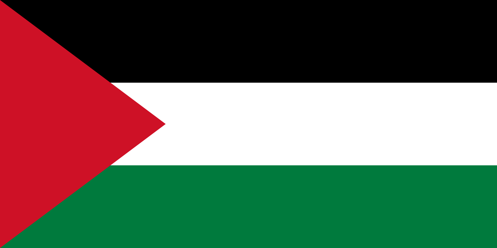

# ***Conflicto de palestina***

## Subtitulo: Inicio del conflicto bélico

### Introduccion

#### El conflicto entre Israel y Palestina se remonta a 1917 cuando el gobierno británico, a través de la Declaración de Balfour, manifestó públicamente su apoyo hacia el establecimiento de un “hogar” para el pueblo judío en la región de Palestina (la cual en ese momento formaba parte del Imperio Otomano).

# 

#### paises que lo cinforman: 

1. #### Israel
2. #### Cisjordania con Jerusalén Este
3. #### Franja de Gaza 
4. #### Jordania

 

